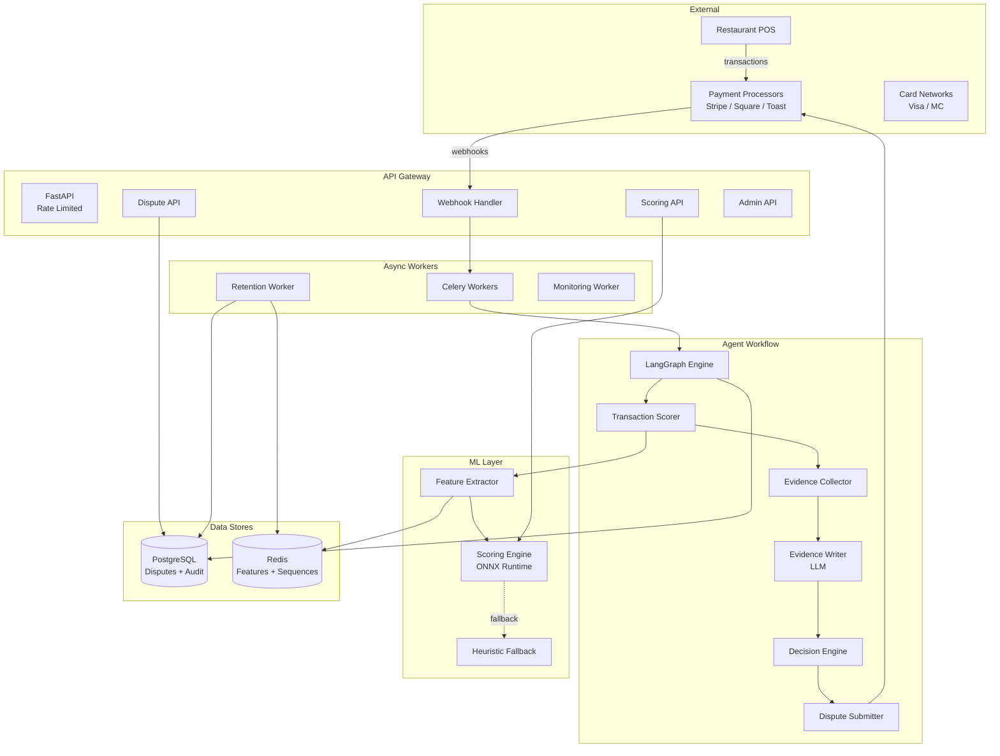
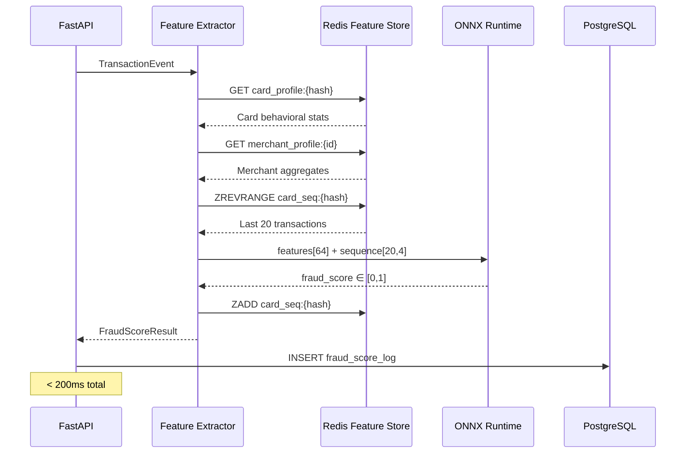
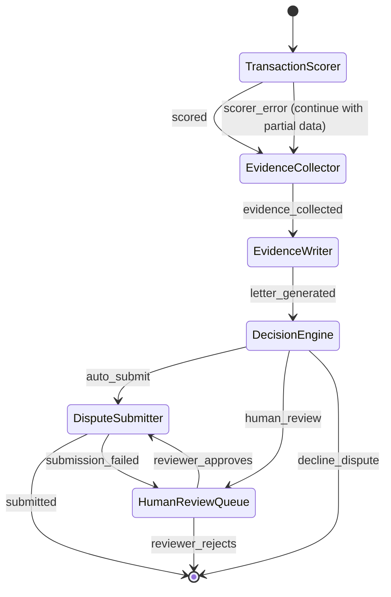
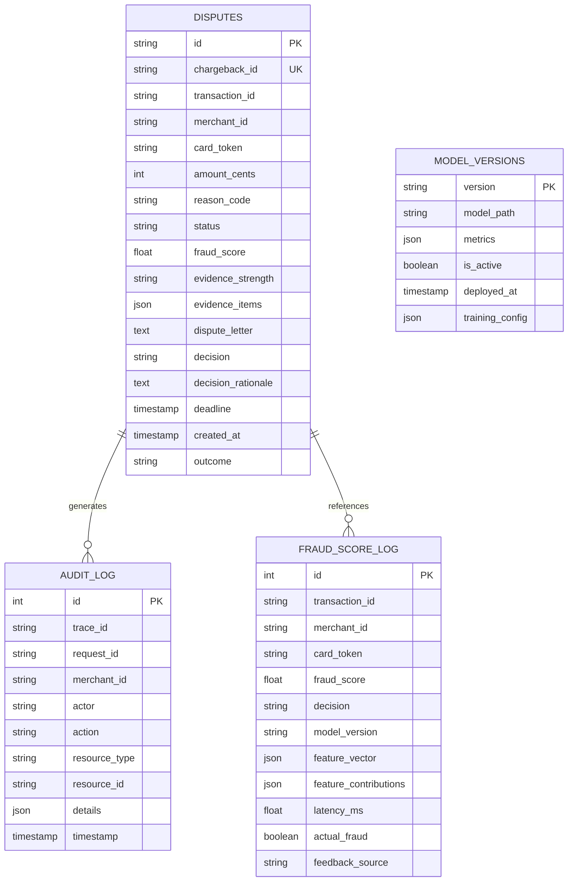
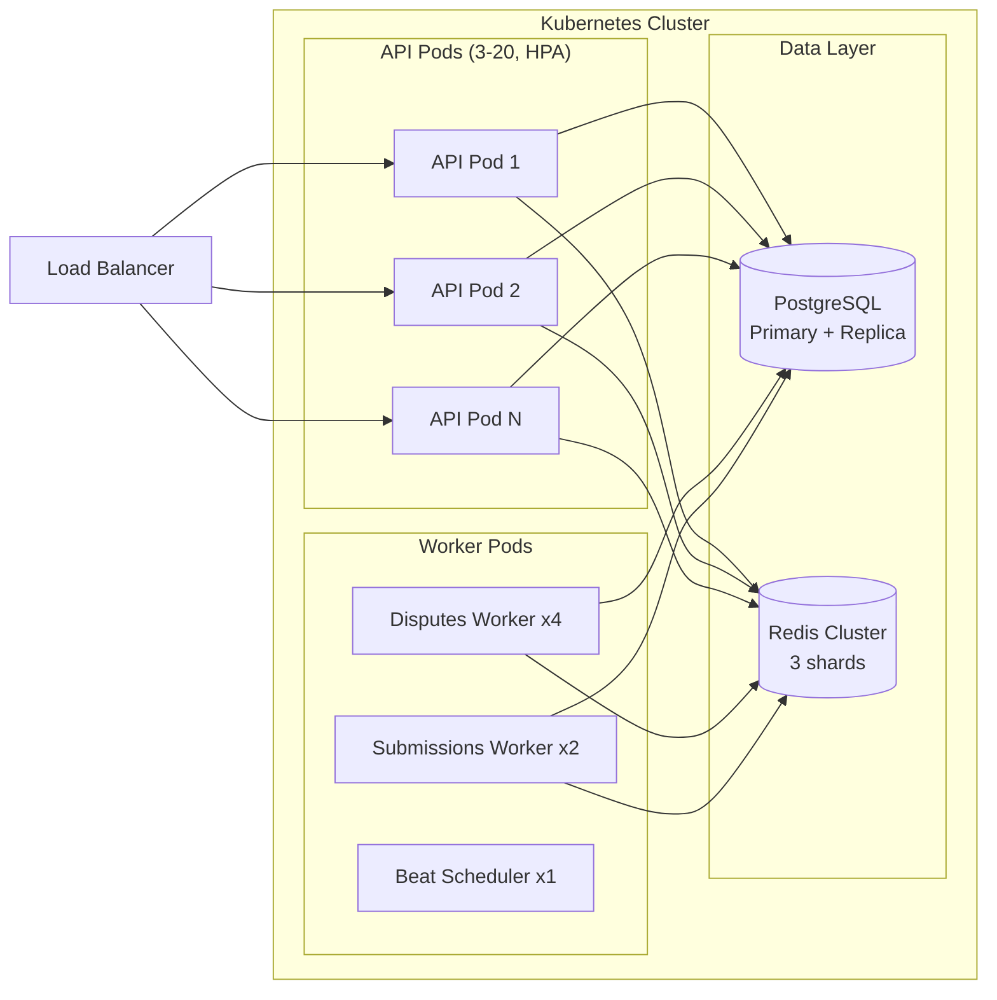
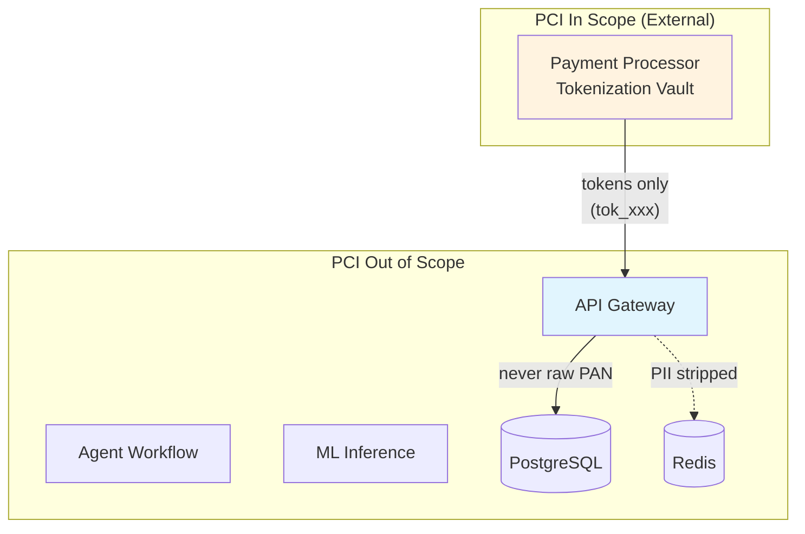

# System Architecture

## High-Level Overview

```mermaid
graph TB
    subgraph "External"
        POS[Restaurant POS]
        PP[Payment Processors<br/>Stripe / Square / Toast]
        CN[Card Networks<br/>Visa / MC]
    end

    subgraph "API Gateway"
        FW[FastAPI<br/>Rate Limited]
        WH[Webhook Handler]
        SA[Scoring API]
        DA[Dispute API]
        AA[Admin API]
    end

    subgraph "Agent Workflow"
        LG[LangGraph Engine]
        TS[Transaction Scorer]
        EC[Evidence Collector]
        EW[Evidence Writer<br/>LLM]
        DE[Decision Engine]
        DS[Dispute Submitter]
    end

    subgraph "ML Layer"
        FE[Feature Extractor]
        SE[Scoring Engine<br/>ONNX Runtime]
        HF[Heuristic Fallback]
    end

    subgraph "Data Stores"
        PG[(PostgreSQL<br/>Disputes + Audit)]
        RD[(Redis<br/>Features + Sequences)]
    end

    subgraph "Async Workers"
        CW[Celery Workers]
        RT[Retention Worker]
        MN[Monitoring Worker]
    end

    POS -->|transactions| PP
    PP -->|webhooks| WH
    WH --> CW
    CW --> LG
    LG --> TS --> EC --> EW --> DE --> DS
    TS --> FE --> SE
    SE -.->|fallback| HF
    FE --> RD
    DS --> PP
    SA --> SE
    DA --> PG
    LG --> PG
    RT --> PG
    RT --> RD
```

## Fraud Scoring Pipeline

```mermaid
sequenceDiagram
    participant API as FastAPI
    participant FE as Feature Extractor
    participant Redis as Redis Feature Store
    participant ONNX as ONNX Runtime
    participant DB as PostgreSQL

    API->>FE: TransactionEvent
    FE->>Redis: GET card_profile:{hash}
    Redis-->>FE: Card behavioral stats
    FE->>Redis: GET merchant_profile:{id}
    Redis-->>FE: Merchant aggregates
    FE->>Redis: ZREVRANGE card_seq:{hash}
    Redis-->>FE: Last 20 transactions
    FE->>ONNX: features[64] + sequence[20,4]
    ONNX-->>FE: fraud_score ∈ [0,1]
    FE->>Redis: ZADD card_seq:{hash}
    FE-->>API: FraudScoreResult
    API->>DB: INSERT fraud_score_log
    Note over API: < 200ms total
```

## Dispute Agent Workflow

```mermaid
stateDiagram-v2
    [*] --> TransactionScorer
    TransactionScorer --> EvidenceCollector: scored
    TransactionScorer --> EvidenceCollector: scorer_error (continue with partial data)

    EvidenceCollector --> EvidenceWriter: evidence_collected
    EvidenceWriter --> DecisionEngine: letter_generated

    DecisionEngine --> DisputeSubmitter: auto_submit
    DecisionEngine --> HumanReviewQueue: human_review
    DecisionEngine --> [*]: decline_dispute

    DisputeSubmitter --> [*]: submitted
    DisputeSubmitter --> HumanReviewQueue: submission_failed

    HumanReviewQueue --> DisputeSubmitter: reviewer_approves
    HumanReviewQueue --> [*]: reviewer_rejects
```

## Data Model

```mermaid
erDiagram
    DISPUTES {
        string id PK
        string chargeback_id UK
        string transaction_id
        string merchant_id
        string card_token
        int amount_cents
        string reason_code
        string status
        float fraud_score
        string evidence_strength
        json evidence_items
        text dispute_letter
        string decision
        text decision_rationale
        timestamp deadline
        timestamp created_at
        string outcome
    }

    FRAUD_SCORE_LOG {
        int id PK
        string transaction_id
        string merchant_id
        string card_token
        float fraud_score
        string decision
        string model_version
        json feature_vector
        json feature_contributions
        float latency_ms
        boolean actual_fraud
        string feedback_source
    }

    AUDIT_LOG {
        int id PK
        string trace_id
        string request_id
        string merchant_id
        string actor
        string action
        string resource_type
        string resource_id
        json details
        timestamp timestamp
    }

    MODEL_VERSIONS {
        string version PK
        string model_path
        json metrics
        boolean is_active
        timestamp deployed_at
        json training_config
    }

    DISPUTES ||--o{ AUDIT_LOG : "generates"
    DISPUTES ||--o{ FRAUD_SCORE_LOG : "references"
```

## Deployment Topology

```mermaid
graph LR
    subgraph "Kubernetes Cluster"
        subgraph "API Pods (3-20, HPA)"
            A1[API Pod 1]
            A2[API Pod 2]
            A3[API Pod N]
        end

        subgraph "Worker Pods"
            W1[Disputes Worker x4]
            W2[Submissions Worker x2]
            W3[Beat Scheduler x1]
        end

        subgraph "Data Layer"
            PG[(PostgreSQL<br/>Primary + Replica)]
            RD[(Redis Cluster<br/>3 shards)]
        end
    end

    LB[Load Balancer] --> A1 & A2 & A3
    A1 & A2 & A3 --> PG
    A1 & A2 & A3 --> RD
    W1 & W2 --> PG
    W1 & W2 --> RD
```

## Security Boundaries

```mermaid
graph TB
    subgraph "PCI Out of Scope"
        direction TB
        API[API Gateway]
        AGENTS[Agent Workflow]
        ML[ML Inference]
        DB[(PostgreSQL)]
        REDIS[(Redis)]
    end

    subgraph "PCI In Scope (External)"
        PP[Payment Processor<br/>Tokenization Vault]
    end

    PP -->|"tokens only<br/>(tok_xxx)"| API
    API -->|"never raw PAN"| DB
    API -.->|"PII stripped"| REDIS

    style API fill:#e1f5fe
    style PP fill:#fff3e0
```
