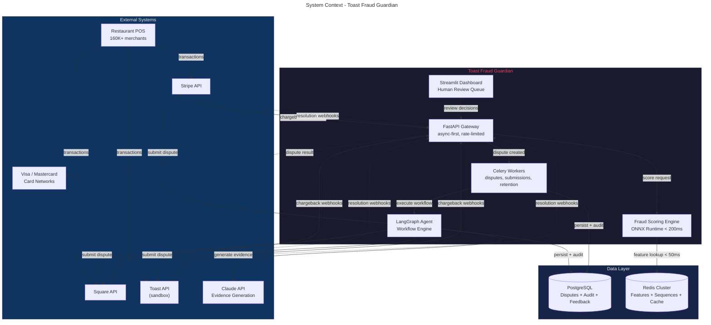

```mermaid
---
title: System Context - Toast Fraud Guardian
---
graph TB
    subgraph External["External Systems"]
        POS["Restaurant POS<br/>160K+ merchants"]
        STRIPE["Stripe API"]
        SQUARE["Square API"]
        TOAST["Toast API<br/>(sandbox)"]
        VISA["Visa / Mastercard<br/>Card Networks"]
        LLM_EXT["Claude API<br/>Evidence Generation"]
    end

    subgraph TFG["Toast Fraud Guardian"]
        direction TB
        API["FastAPI Gateway<br/>async-first, rate-limited"]
        AGENTS["LangGraph Agent<br/>Workflow Engine"]
        SCORER["Fraud Scoring Engine<br/>ONNX Runtime < 200ms"]
        WORKERS["Celery Workers<br/>disputes, submissions, retention"]
        DASHBOARD["Streamlit Dashboard<br/>Human Review Queue"]
    end

    subgraph Data["Data Layer"]
        PG[("PostgreSQL<br/>Disputes + Audit + Feedback")]
        REDIS[("Redis Cluster<br/>Features + Sequences + Cache")]
    end

    POS -->|"transactions"| STRIPE & SQUARE & TOAST
    STRIPE & SQUARE & TOAST -->|"chargeback webhooks"| API
    API -->|"score request"| SCORER
    API -->|"dispute created"| WORKERS
    WORKERS -->|"execute workflow"| AGENTS
    AGENTS -->|"generate evidence"| LLM_EXT
    AGENTS -->|"submit dispute"| STRIPE & SQUARE & TOAST
    SCORER -->|"feature lookup < 50ms"| REDIS
    AGENTS & WORKERS -->|"persist + audit"| PG
    DASHBOARD -->|"review decisions"| API
    STRIPE & SQUARE & TOAST -.->|"resolution webhooks"| API
    API -.->|"dispute result"| VISA

    style TFG fill:#1a1a2e,stroke:#16213e,color:#e94560
    style External fill:#0f3460,stroke:#16213e,color:#e8e8e8
    style Data fill:#162447,stroke:#16213e,color:#e8e8e8
```
