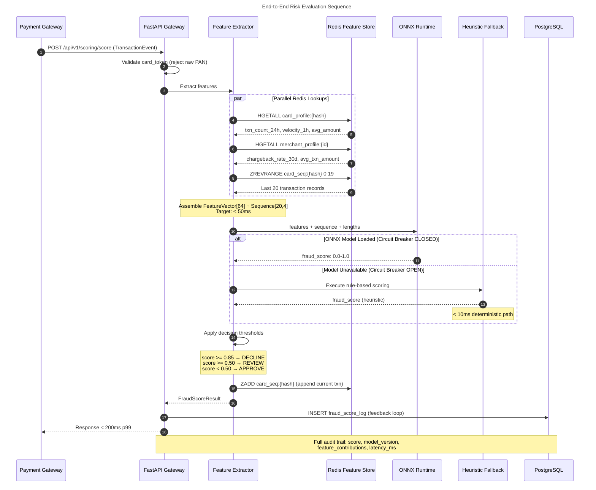

```mermaid
---
title: End-to-End Risk Evaluation Sequence
---
sequenceDiagram
    autonumber
    participant PG as Payment Gateway
    participant API as FastAPI Gateway
    participant FE as Feature Extractor
    participant REDIS as Redis Feature Store
    participant ONNX as ONNX Runtime
    participant HF as Heuristic Fallback
    participant DB as PostgreSQL

    PG->>API: POST /api/v1/scoring/score (TransactionEvent)
    API->>API: Validate card_token (reject raw PAN)
    API->>FE: Extract features

    par Parallel Redis Lookups
        FE->>REDIS: HGETALL card_profile:{hash}
        REDIS-->>FE: txn_count_24h, velocity_1h, avg_amount
        FE->>REDIS: HGETALL merchant_profile:{id}
        REDIS-->>FE: chargeback_rate_30d, avg_txn_amount
        FE->>REDIS: ZREVRANGE card_seq:{hash} 0 19
        REDIS-->>FE: Last 20 transaction records
    end

    Note over FE: Assemble FeatureVector[64] + Sequence[20,4]<br/>Target: < 50ms

    FE->>ONNX: features + sequence + lengths

    alt ONNX Model Loaded (Circuit Breaker CLOSED)
        ONNX-->>FE: fraud_score: 0.0-1.0
    else Model Unavailable (Circuit Breaker OPEN)
        FE->>HF: Execute rule-based scoring
        HF-->>FE: fraud_score (heuristic)
        Note over HF: < 10ms deterministic path
    end

    FE->>FE: Apply decision thresholds
    Note over FE: score >= 0.85 → DECLINE<br/>score >= 0.50 → REVIEW<br/>score < 0.50 → APPROVE

    FE->>REDIS: ZADD card_seq:{hash} (append current txn)
    FE-->>API: FraudScoreResult

    API->>DB: INSERT fraud_score_log (feedback loop)
    API-->>PG: Response < 200ms p99

    Note over API,DB: Full audit trail: score, model_version,<br/>feature_contributions, latency_ms
```
