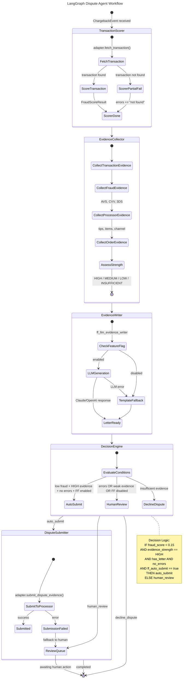

```mermaid
---
title: LangGraph Dispute Agent Workflow
---
stateDiagram-v2
    [*] --> TransactionScorer: ChargebackEvent received

    state TransactionScorer {
        [*] --> FetchTransaction: adapter.fetch_transaction()
        FetchTransaction --> ScoreTransaction: transaction found
        FetchTransaction --> ScorerPartialFail: transaction not found
        ScoreTransaction --> ScorerDone: FraudScoreResult
        ScorerPartialFail --> ScorerDone: errors += "not found"
    }

    TransactionScorer --> EvidenceCollector

    state EvidenceCollector {
        [*] --> CollectTransactionEvidence
        CollectTransactionEvidence --> CollectFraudEvidence
        CollectFraudEvidence --> CollectProcessorEvidence: AVS, CVV, 3DS
        CollectProcessorEvidence --> CollectOrderEvidence: tips, items, channel
        CollectOrderEvidence --> AssessStrength
        AssessStrength --> [*]: HIGH / MEDIUM / LOW / INSUFFICIENT
    }

    EvidenceCollector --> EvidenceWriter

    state EvidenceWriter {
        [*] --> CheckFeatureFlag: ff_llm_evidence_writer
        CheckFeatureFlag --> LLMGeneration: enabled
        CheckFeatureFlag --> TemplateFallback: disabled
        LLMGeneration --> LetterReady: Claude/OpenAI response
        LLMGeneration --> TemplateFallback: LLM error
        TemplateFallback --> LetterReady
    }

    EvidenceWriter --> DecisionEngine

    state DecisionEngine {
        [*] --> EvaluateConditions
        EvaluateConditions --> AutoSubmit: low fraud + HIGH evidence + no errors + FF enabled
        EvaluateConditions --> HumanReview: errors OR weak evidence OR FF disabled
        EvaluateConditions --> DeclineDispute: insufficient evidence
    }

    DecisionEngine --> DisputeSubmitter: auto_submit
    DecisionEngine --> ReviewQueue: human_review
    DecisionEngine --> [*]: decline_dispute

    state DisputeSubmitter {
        [*] --> SubmitToProcessor: adapter.submit_dispute_evidence()
        SubmitToProcessor --> Submitted: success
        SubmitToProcessor --> SubmissionFailed: error
        SubmissionFailed --> ReviewQueue: fallback to human
    }

    DisputeSubmitter --> [*]: completed
    ReviewQueue --> [*]: awaiting human action

    note right of DecisionEngine
        Decision Logic:
        IF fraud_score < 0.15
        AND evidence_strength == HIGH
        AND has_letter AND no_errors
        AND ff_auto_submit == true
        THEN auto_submit
        ELSE human_review
    end note
```
