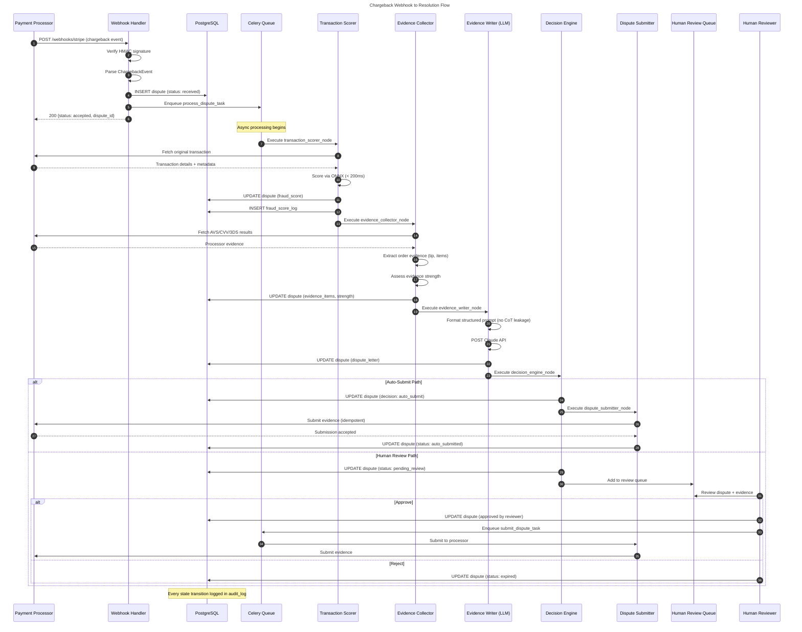

```mermaid
---
title: Chargeback Webhook to Resolution Flow
---
sequenceDiagram
    autonumber
    participant PP as Payment Processor
    participant WH as Webhook Handler
    participant DB as PostgreSQL
    participant CQ as Celery Queue
    participant TS as Transaction Scorer
    participant EC as Evidence Collector
    participant EW as Evidence Writer (LLM)
    participant DE as Decision Engine
    participant DS as Dispute Submitter
    participant RQ as Human Review Queue
    participant HR as Human Reviewer

    PP->>WH: POST /webhooks/stripe (chargeback event)
    WH->>WH: Verify HMAC signature
    WH->>WH: Parse ChargebackEvent
    WH->>DB: INSERT dispute (status: received)
    WH->>CQ: Enqueue process_dispute_task
    WH-->>PP: 200 {status: accepted, dispute_id}

    Note over CQ: Async processing begins

    CQ->>TS: Execute transaction_scorer_node
    TS->>PP: Fetch original transaction
    PP-->>TS: Transaction details + metadata
    TS->>TS: Score via ONNX (< 200ms)
    TS->>DB: UPDATE dispute (fraud_score)
    TS->>DB: INSERT fraud_score_log

    TS->>EC: Execute evidence_collector_node
    EC->>PP: Fetch AVS/CVV/3DS results
    PP-->>EC: Processor evidence
    EC->>EC: Extract order evidence (tip, items)
    EC->>EC: Assess evidence strength
    EC->>DB: UPDATE dispute (evidence_items, strength)

    EC->>EW: Execute evidence_writer_node
    EW->>EW: Format structured prompt (no CoT leakage)
    EW->>EW: POST Claude API
    EW->>DB: UPDATE dispute (dispute_letter)

    EW->>DE: Execute decision_engine_node

    alt Auto-Submit Path
        DE->>DB: UPDATE dispute (decision: auto_submit)
        DE->>DS: Execute dispute_submitter_node
        DS->>PP: Submit evidence (idempotent)
        PP-->>DS: Submission accepted
        DS->>DB: UPDATE dispute (status: auto_submitted)
    else Human Review Path
        DE->>DB: UPDATE dispute (status: pending_review)
        DE->>RQ: Add to review queue

        HR->>RQ: Review dispute + evidence
        alt Approve
            HR->>DB: UPDATE dispute (approved by reviewer)
            HR->>CQ: Enqueue submit_dispute_task
            CQ->>DS: Submit to processor
            DS->>PP: Submit evidence
        else Reject
            HR->>DB: UPDATE dispute (status: expired)
        end
    end

    Note over DB: Every state transition logged in audit_log
```
