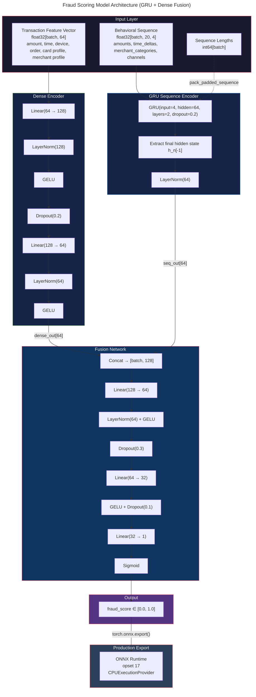

```mermaid
---
title: Fraud Scoring Model Architecture (GRU + Dense Fusion)
---
graph TB
    subgraph Input["Input Layer"]
        FV["Transaction Feature Vector<br/>float32[batch, 64]<br/>amount, time, device, order, card profile, merchant profile"]
        SEQ["Behavioral Sequence<br/>float32[batch, 20, 4]<br/>amounts, time_deltas, merchant_categories, channels"]
        LEN["Sequence Lengths<br/>int64[batch]"]
    end

    subgraph DenseEncoder["Dense Encoder"]
        D1["Linear(64 → 128)"]
        D2["LayerNorm(128)"]
        D3["GELU"]
        D4["Dropout(0.2)"]
        D5["Linear(128 → 64)"]
        D6["LayerNorm(64)"]
        D7["GELU"]
    end

    subgraph SequenceEncoder["GRU Sequence Encoder"]
        G1["GRU(input=4, hidden=64, layers=2, dropout=0.2)"]
        G2["Extract final hidden state h_n[-1]"]
        G3["LayerNorm(64)"]
    end

    subgraph Fusion["Fusion Network"]
        C1["Concat → [batch, 128]"]
        F1["Linear(128 → 64)"]
        F2["LayerNorm(64) + GELU"]
        F3["Dropout(0.3)"]
        F4["Linear(64 → 32)"]
        F5["GELU + Dropout(0.1)"]
        F6["Linear(32 → 1)"]
        F7["Sigmoid"]
    end

    subgraph Output["Output"]
        SCORE["fraud_score ∈ [0.0, 1.0]"]
    end

    subgraph Export["Production Export"]
        ONNX["ONNX Runtime<br/>opset 17<br/>CPUExecutionProvider"]
    end

    FV --> D1 --> D2 --> D3 --> D4 --> D5 --> D6 --> D7
    SEQ --> G1
    LEN -.->|"pack_padded_sequence"| G1
    G1 --> G2 --> G3

    D7 -->|"dense_out[64]"| C1
    G3 -->|"seq_out[64]"| C1
    C1 --> F1 --> F2 --> F3 --> F4 --> F5 --> F6 --> F7

    F7 --> SCORE
    SCORE -->|"torch.onnx.export()"| ONNX

    style Input fill:#1a1a2e,stroke:#e94560,color:#eee
    style DenseEncoder fill:#162447,stroke:#1b5e20,color:#eee
    style SequenceEncoder fill:#162447,stroke:#1565c0,color:#eee
    style Fusion fill:#0f3460,stroke:#e94560,color:#eee
    style Output fill:#533483,stroke:#e94560,color:#eee
    style Export fill:#2d4059,stroke:#ea5455,color:#eee
```
