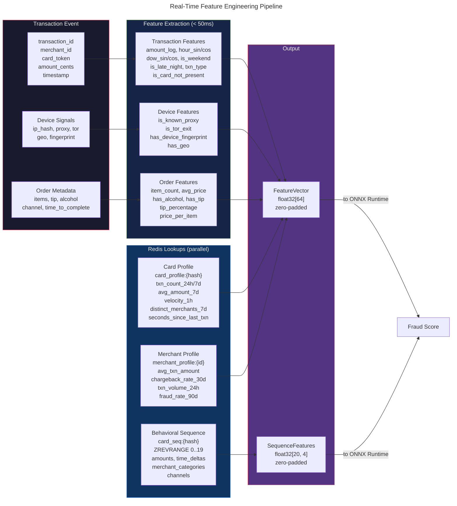

```mermaid
---
title: Real-Time Feature Engineering Pipeline
---
graph LR
    subgraph TransactionInput["Transaction Event"]
        TXN["transaction_id<br/>merchant_id<br/>card_token<br/>amount_cents<br/>timestamp"]
        DEV["Device Signals<br/>ip_hash, proxy, tor<br/>geo, fingerprint"]
        ORD["Order Metadata<br/>items, tip, alcohol<br/>channel, time_to_complete"]
    end

    subgraph FeatureExtraction["Feature Extraction (< 50ms)"]
        direction TB
        TF["Transaction Features<br/>amount_log, hour_sin/cos<br/>dow_sin/cos, is_weekend<br/>is_late_night, txn_type<br/>is_card_not_present"]
        DF["Device Features<br/>is_known_proxy<br/>is_tor_exit<br/>has_device_fingerprint<br/>has_geo"]
        OF["Order Features<br/>item_count, avg_price<br/>has_alcohol, has_tip<br/>tip_percentage<br/>price_per_item"]
    end

    subgraph RedisLookups["Redis Lookups (parallel)"]
        CP["Card Profile<br/>card_profile:{hash}<br/>txn_count_24h/7d<br/>avg_amount_7d<br/>velocity_1h<br/>distinct_merchants_7d<br/>seconds_since_last_txn"]
        MP["Merchant Profile<br/>merchant_profile:{id}<br/>avg_txn_amount<br/>chargeback_rate_30d<br/>txn_volume_24h<br/>fraud_rate_90d"]
        SQ["Behavioral Sequence<br/>card_seq:{hash}<br/>ZREVRANGE 0..19<br/>amounts, time_deltas<br/>merchant_categories<br/>channels"]
    end

    subgraph OutputVectors["Output"]
        FV["FeatureVector<br/>float32[64]<br/>zero-padded"]
        SF["SequenceFeatures<br/>float32[20, 4]<br/>zero-padded"]
    end

    TXN --> TF
    DEV --> DF
    ORD --> OF

    TF & DF & OF --> FV
    CP --> FV
    MP --> FV
    SQ --> SF

    FV & SF -->|"to ONNX Runtime"| SCORE["Fraud Score"]

    style TransactionInput fill:#1a1a2e,stroke:#e94560,color:#eee
    style FeatureExtraction fill:#162447,stroke:#1b5e20,color:#eee
    style RedisLookups fill:#0f3460,stroke:#1565c0,color:#eee
    style OutputVectors fill:#533483,stroke:#e94560,color:#eee
```
