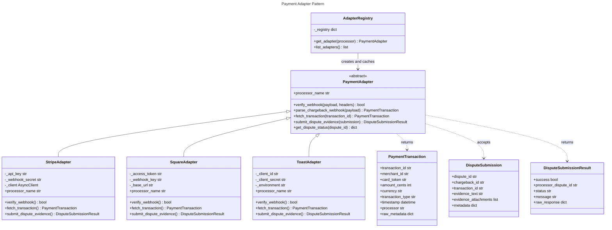

```mermaid
---
title: Payment Adapter Pattern
---
classDiagram
    class PaymentAdapter {
        <<abstract>>
        +processor_name str
        +verify_webhook(payload, headers) bool
        +parse_chargeback_webhook(payload) PaymentTransaction
        +fetch_transaction(transaction_id) PaymentTransaction
        +submit_dispute_evidence(submission) DisputeSubmissionResult
        +get_dispute_status(dispute_id) dict
    }

    class StripeAdapter {
        -_api_key str
        -_webhook_secret str
        -_client AsyncClient
        +processor_name str
        +verify_webhook() bool
        +fetch_transaction() PaymentTransaction
        +submit_dispute_evidence() DisputeSubmissionResult
    }

    class SquareAdapter {
        -_access_token str
        -_webhook_key str
        -_base_url str
        +processor_name str
        +verify_webhook() bool
        +fetch_transaction() PaymentTransaction
        +submit_dispute_evidence() DisputeSubmissionResult
    }

    class ToastAdapter {
        -_client_id str
        -_client_secret str
        -_environment str
        +processor_name str
        +verify_webhook() bool
        +fetch_transaction() PaymentTransaction
        +submit_dispute_evidence() DisputeSubmissionResult
    }

    class PaymentTransaction {
        +transaction_id str
        +merchant_id str
        +card_token str
        +amount_cents int
        +currency str
        +transaction_type str
        +timestamp datetime
        +processor str
        +raw_metadata dict
    }

    class DisputeSubmission {
        +dispute_id str
        +chargeback_id str
        +transaction_id str
        +evidence_text str
        +evidence_attachments list
        +metadata dict
    }

    class DisputeSubmissionResult {
        +success bool
        +processor_dispute_id str
        +status str
        +message str
        +raw_response dict
    }

    class AdapterRegistry {
        -_registry dict
        +get_adapter(processor) PaymentAdapter
        +list_adapters() list
    }

    PaymentAdapter <|-- StripeAdapter
    PaymentAdapter <|-- SquareAdapter
    PaymentAdapter <|-- ToastAdapter
    PaymentAdapter ..> PaymentTransaction : returns
    PaymentAdapter ..> DisputeSubmission : accepts
    PaymentAdapter ..> DisputeSubmissionResult : returns
    AdapterRegistry --> PaymentAdapter : creates and caches
```
