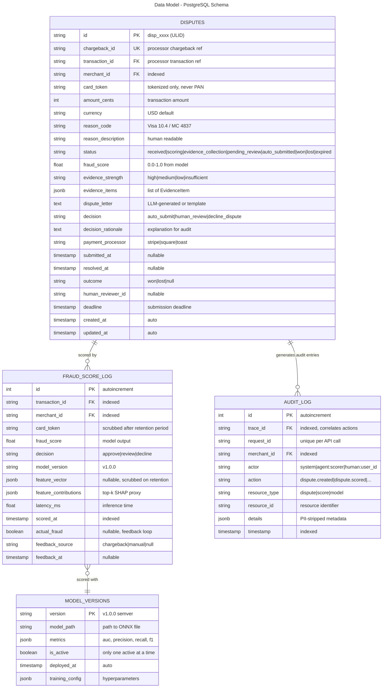

```mermaid
---
title: Data Model - PostgreSQL Schema
---
erDiagram
    DISPUTES {
        string id PK "disp_xxxx (ULID)"
        string chargeback_id UK "processor chargeback ref"
        string transaction_id FK "processor transaction ref"
        string merchant_id FK "indexed"
        string card_token "tokenized only, never PAN"
        int amount_cents "transaction amount"
        string currency "USD default"
        string reason_code "Visa 10.4 / MC 4837"
        string reason_description "human readable"
        string status "received|scoring|evidence_collection|pending_review|auto_submitted|won|lost|expired"
        float fraud_score "0.0-1.0 from model"
        string evidence_strength "high|medium|low|insufficient"
        jsonb evidence_items "list of EvidenceItem"
        text dispute_letter "LLM-generated or template"
        string decision "auto_submit|human_review|decline_dispute"
        text decision_rationale "explanation for audit"
        string payment_processor "stripe|square|toast"
        timestamp submitted_at "nullable"
        timestamp resolved_at "nullable"
        string outcome "won|lost|null"
        string human_reviewer_id "nullable"
        timestamp deadline "submission deadline"
        timestamp created_at "auto"
        timestamp updated_at "auto"
    }

    FRAUD_SCORE_LOG {
        int id PK "autoincrement"
        string transaction_id FK "indexed"
        string merchant_id FK "indexed"
        string card_token "scrubbed after retention period"
        float fraud_score "model output"
        string decision "approve|review|decline"
        string model_version "v1.0.0"
        jsonb feature_vector "nullable, scrubbed on retention"
        jsonb feature_contributions "top-k SHAP proxy"
        float latency_ms "inference time"
        timestamp scored_at "indexed"
        boolean actual_fraud "nullable, feedback loop"
        string feedback_source "chargeback|manual|null"
        timestamp feedback_at "nullable"
    }

    AUDIT_LOG {
        int id PK "autoincrement"
        string trace_id FK "indexed, correlates actions"
        string request_id "unique per API call"
        string merchant_id FK "indexed"
        string actor "system|agent:scorer|human:user_id"
        string action "dispute.created|dispute.scored|..."
        string resource_type "dispute|score|model"
        string resource_id "resource identifier"
        jsonb details "PII-stripped metadata"
        timestamp timestamp "indexed"
    }

    MODEL_VERSIONS {
        string version PK "v1.0.0 semver"
        string model_path "path to ONNX file"
        jsonb metrics "auc, precision, recall, f1"
        boolean is_active "only one active at a time"
        timestamp deployed_at "auto"
        jsonb training_config "hyperparameters"
    }

    DISPUTES ||--o{ FRAUD_SCORE_LOG : "scored by"
    DISPUTES ||--o{ AUDIT_LOG : "generates audit entries"
    FRAUD_SCORE_LOG }o--|| MODEL_VERSIONS : "scored with"
```
