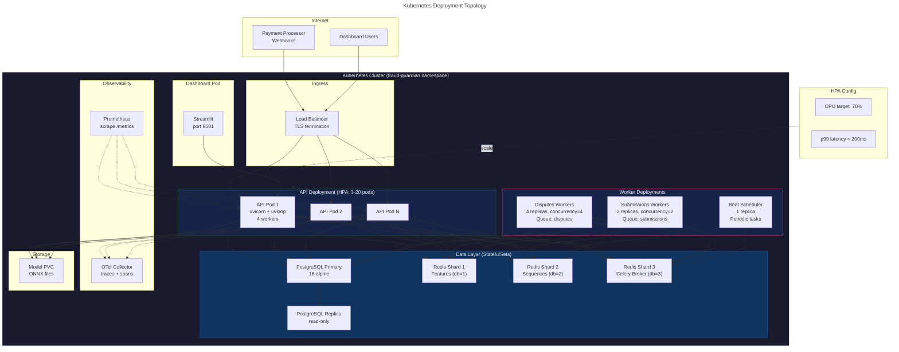

```mermaid
---
title: Kubernetes Deployment Topology
---
graph TB
    subgraph Internet
        WEBHOOK["Payment Processor<br/>Webhooks"]
        CLIENT["Dashboard Users"]
    end

    subgraph K8s["Kubernetes Cluster (fraud-guardian namespace)"]
        subgraph Ingress
            LB["Load Balancer<br/>TLS termination"]
        end

        subgraph APIPods["API Deployment (HPA: 3-20 pods)"]
            A1["API Pod 1<br/>uvicorn + uvloop<br/>4 workers"]
            A2["API Pod 2"]
            A3["API Pod N"]
        end

        subgraph WorkerPods["Worker Deployments"]
            WD["Disputes Workers<br/>4 replicas, concurrency=4<br/>Queue: disputes"]
            WS["Submissions Workers<br/>2 replicas, concurrency=2<br/>Queue: submissions"]
            WB["Beat Scheduler<br/>1 replica<br/>Periodic tasks"]
        end

        subgraph Dashboard["Dashboard Pod"]
            ST["Streamlit<br/>port 8501"]
        end

        subgraph DataPods["Data Layer (StatefulSets)"]
            PG_P["PostgreSQL Primary<br/>16-alpine"]
            PG_R["PostgreSQL Replica<br/>read-only"]
            RD1["Redis Shard 1<br/>Features (db=1)"]
            RD2["Redis Shard 2<br/>Sequences (db=2)"]
            RD3["Redis Shard 3<br/>Celery Broker (db=3)"]
        end

        subgraph Observability
            PROM["Prometheus<br/>scrape /metrics"]
            OTEL["OTel Collector<br/>traces + spans"]
        end

        subgraph Storage
            PVC["Model PVC<br/>ONNX files"]
        end
    end

    WEBHOOK --> LB
    CLIENT --> LB
    LB --> A1 & A2 & A3
    A1 & A2 & A3 --> PG_P
    A1 & A2 & A3 --> RD1 & RD2
    A1 & A2 & A3 --> RD3
    WD & WS --> PG_P
    WD & WS --> RD1 & RD2 & RD3
    WB --> RD3
    ST --> A1
    PG_P --> PG_R
    PROM -.-> A1 & A2 & A3
    A1 & A2 & A3 -.-> OTEL
    A1 & A2 & A3 --> PVC

    subgraph HPA["HPA Config"]
        direction LR
        CPU["CPU target: 70%"]
        LAT["p99 latency < 200ms"]
    end

    HPA -.->|"scale"| APIPods

    style K8s fill:#1a1a2e,stroke:#16213e,color:#eee
    style APIPods fill:#162447,stroke:#1b5e20,color:#eee
    style WorkerPods fill:#162447,stroke:#e94560,color:#eee
    style DataPods fill:#0f3460,stroke:#1565c0,color:#eee
```
