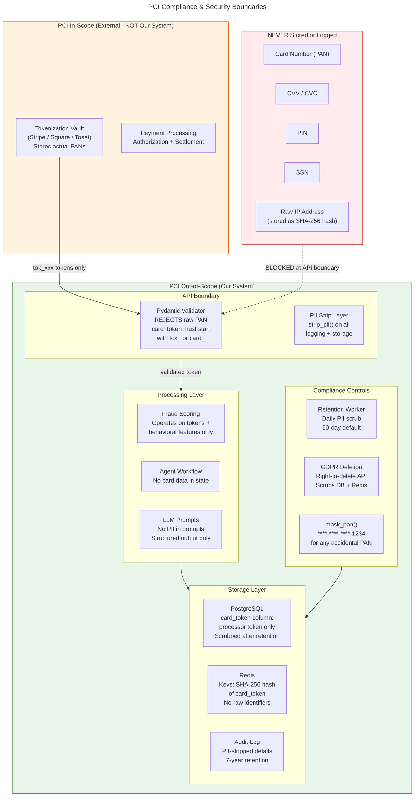

```mermaid
---
title: PCI Compliance & Security Boundaries
---
graph TB
    subgraph PCI_SCOPE["PCI In-Scope (External - NOT Our System)"]
        style PCI_SCOPE fill:#fff3e0,stroke:#e65100,color:#333
        VAULT["Tokenization Vault<br/>(Stripe / Square / Toast)<br/>Stores actual PANs"]
        PROC["Payment Processing<br/>Authorization + Settlement"]
    end

    subgraph OUT_OF_SCOPE["PCI Out-of-Scope (Our System)"]
        style OUT_OF_SCOPE fill:#e8f5e9,stroke:#2e7d32,color:#333

        subgraph APIBoundary["API Boundary"]
            VAL["Pydantic Validator<br/>REJECTS raw PAN<br/>card_token must start<br/>with tok_ or card_"]
            PII["PII Strip Layer<br/>strip_pii() on all<br/>logging + storage"]
        end

        subgraph Processing["Processing Layer"]
            SCORE["Fraud Scoring<br/>Operates on tokens +<br/>behavioral features only"]
            AGENT["Agent Workflow<br/>No card data in state"]
            LLM["LLM Prompts<br/>No PII in prompts<br/>Structured output only"]
        end

        subgraph Storage["Storage Layer"]
            DB["PostgreSQL<br/>card_token column:<br/>processor token only<br/>Scrubbed after retention"]
            REDIS["Redis<br/>Keys: SHA-256 hash<br/>of card_token<br/>No raw identifiers"]
            AUDIT["Audit Log<br/>PII-stripped details<br/>7-year retention"]
        end

        subgraph Compliance["Compliance Controls"]
            RET["Retention Worker<br/>Daily PII scrub<br/>90-day default"]
            GDPR["GDPR Deletion<br/>Right-to-delete API<br/>Scrubs DB + Redis"]
            MASK["mask_pan()<br/>****-****-****-1234<br/>for any accidental PAN"]
        end
    end

    VAULT -->|"tok_xxx tokens only"| VAL
    VAL -->|"validated token"| Processing
    Processing --> Storage
    Compliance --> Storage

    subgraph NeverStored["NEVER Stored or Logged"]
        style NeverStored fill:#ffebee,stroke:#c62828,color:#333
        PAN["Card Number (PAN)"]
        CVV["CVV / CVC"]
        PIN["PIN"]
        SSN["SSN"]
        RAW_IP["Raw IP Address<br/>(stored as SHA-256 hash)"]
    end

    NeverStored -.->|"BLOCKED at API boundary"| VAL
```
