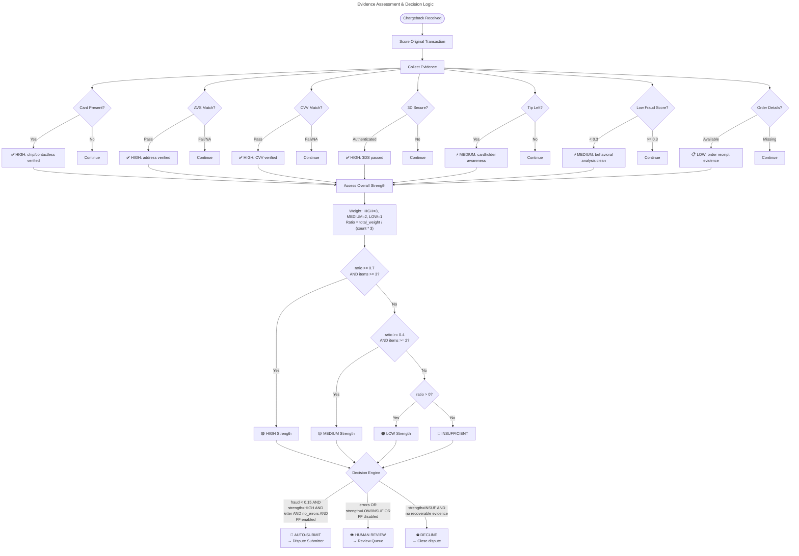

```mermaid
---
title: Evidence Assessment & Decision Logic
---
flowchart TD
    START([Chargeback Received]) --> SCORE[Score Original Transaction]
    SCORE --> COLLECT[Collect Evidence]

    COLLECT --> E1{Card Present?}
    E1 -->|Yes| E1Y["✅ HIGH: chip/contactless verified"]
    E1 -->|No| E1N["Continue"]

    COLLECT --> E2{AVS Match?}
    E2 -->|Pass| E2Y["✅ HIGH: address verified"]
    E2 -->|Fail/NA| E2N["Continue"]

    COLLECT --> E3{CVV Match?}
    E3 -->|Pass| E3Y["✅ HIGH: CVV verified"]
    E3 -->|Fail/NA| E3N["Continue"]

    COLLECT --> E4{3D Secure?}
    E4 -->|Authenticated| E4Y["✅ HIGH: 3DS passed"]
    E4 -->|No| E4N["Continue"]

    COLLECT --> E5{Tip Left?}
    E5 -->|Yes| E5Y["⚡ MEDIUM: cardholder awareness"]
    E5 -->|No| E5N["Continue"]

    COLLECT --> E6{Low Fraud Score?}
    E6 -->|"< 0.3"| E6Y["⚡ MEDIUM: behavioral analysis clean"]
    E6 -->|">= 0.3"| E6N["Continue"]

    COLLECT --> E7{Order Details?}
    E7 -->|Available| E7Y["📋 LOW: order receipt evidence"]
    E7 -->|Missing| E7N["Continue"]

    E1Y & E2Y & E3Y & E4Y & E5Y & E6Y & E7Y --> ASSESS[Assess Overall Strength]

    ASSESS --> WEIGHT["Weight: HIGH=3, MEDIUM=2, LOW=1<br/>Ratio = total_weight / (count * 3)"]

    WEIGHT --> S1{"ratio >= 0.7<br/>AND items >= 3?"}
    S1 -->|Yes| HIGH_STR["🟢 HIGH Strength"]
    S1 -->|No| S2{"ratio >= 0.4<br/>AND items >= 2?"}
    S2 -->|Yes| MED_STR["🟡 MEDIUM Strength"]
    S2 -->|No| S3{"ratio > 0?"}
    S3 -->|Yes| LOW_STR["🟠 LOW Strength"]
    S3 -->|No| INSUF["🔴 INSUFFICIENT"]

    HIGH_STR & MED_STR & LOW_STR & INSUF --> DECIDE{Decision Engine}

    DECIDE -->|"fraud < 0.15 AND<br/>strength=HIGH AND<br/>letter AND no_errors AND<br/>FF enabled"| AUTO["🚀 AUTO-SUBMIT<br/>→ Dispute Submitter"]
    DECIDE -->|"errors OR<br/>strength=LOW/INSUF OR<br/>FF disabled"| REVIEW["👁️ HUMAN REVIEW<br/>→ Review Queue"]
    DECIDE -->|"strength=INSUF AND<br/>no recoverable evidence"| DECLINE["⛔ DECLINE<br/>→ Close dispute"]
```
