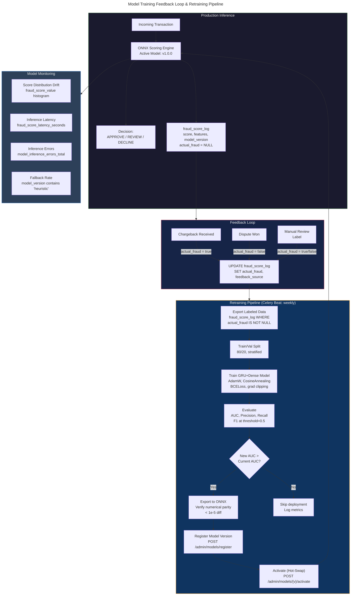

```mermaid
---
title: Model Training Feedback Loop & Retraining Pipeline
---
graph TB
    subgraph Production["Production Inference"]
        TXN["Incoming Transaction"] --> SCORER["ONNX Scoring Engine<br/>Active Model: v1.0.0"]
        SCORER --> DECISION["Decision:<br/>APPROVE / REVIEW / DECLINE"]
        SCORER --> LOG["fraud_score_log<br/>score, features, model_version<br/>actual_fraud = NULL"]
    end

    subgraph FeedbackLoop["Feedback Loop"]
        CB["Chargeback Received"] -->|"actual_fraud = true"| UPDATE["UPDATE fraud_score_log<br/>SET actual_fraud, feedback_source"]
        RESOLVE["Dispute Won"] -->|"actual_fraud = false"| UPDATE
        MANUAL["Manual Review<br/>Label"] -->|"actual_fraud = true/false"| UPDATE
    end

    subgraph Training["Retraining Pipeline (Celery Beat: weekly)"]
        EXPORT_DATA["Export Labeled Data<br/>fraud_score_log WHERE<br/>actual_fraud IS NOT NULL"]
        EXPORT_DATA --> SPLIT["Train/Val Split<br/>80/20, stratified"]
        SPLIT --> TRAIN["Train GRU+Dense Model<br/>AdamW, CosineAnnealing<br/>BCELoss, grad clipping"]
        TRAIN --> EVAL["Evaluate<br/>AUC, Precision, Recall<br/>F1 at threshold=0.5"]
        EVAL --> COMPARE{"New AUC ><br/>Current AUC?"}
        COMPARE -->|Yes| ONNX_EXPORT["Export to ONNX<br/>Verify numerical parity<br/>< 1e-5 diff"]
        COMPARE -->|No| SKIP["Skip deployment<br/>Log metrics"]
        ONNX_EXPORT --> REGISTER["Register Model Version<br/>POST /admin/models/register"]
        REGISTER --> ACTIVATE["Activate (Hot-Swap)<br/>POST /admin/models/{v}/activate"]
        ACTIVATE --> SCORER
    end

    subgraph Monitoring["Model Monitoring"]
        DRIFT["Score Distribution Drift<br/>fraud_score_value histogram"]
        LATENCY["Inference Latency<br/>fraud_score_latency_seconds"]
        ERRORS["Inference Errors<br/>model_inference_errors_total"]
        FALLBACK["Fallback Rate<br/>model_version contains 'heuristic'"]
    end

    LOG --> FeedbackLoop
    UPDATE --> Training
    SCORER --> Monitoring

    style Production fill:#1a1a2e,stroke:#1b5e20,color:#eee
    style FeedbackLoop fill:#162447,stroke:#e94560,color:#eee
    style Training fill:#0f3460,stroke:#ff9800,color:#eee
    style Monitoring fill:#2d4059,stroke:#1565c0,color:#eee
```
