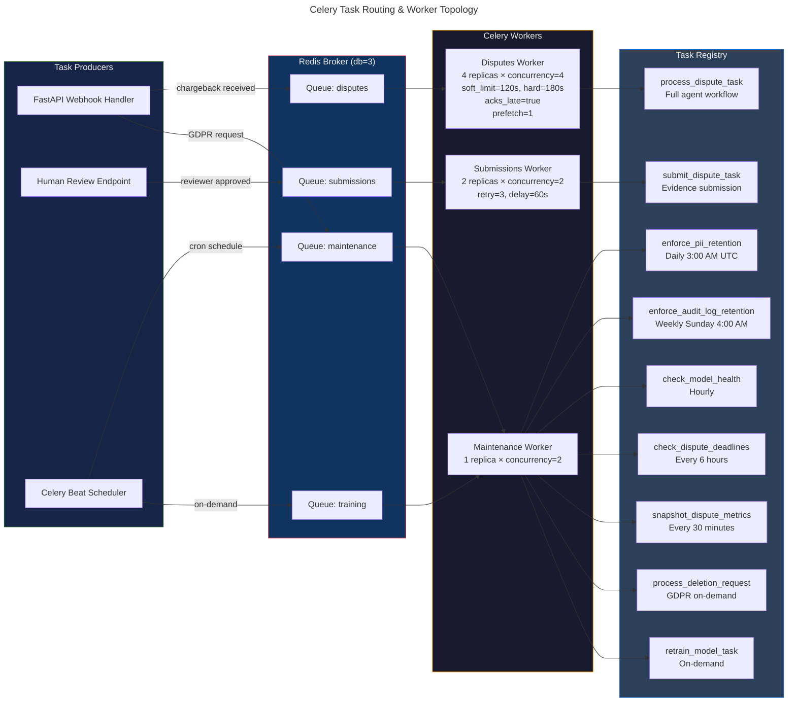

```mermaid
---
title: Celery Task Routing & Worker Topology
---
graph LR
    subgraph Producers["Task Producers"]
        API["FastAPI Webhook Handler"]
        REVIEW["Human Review Endpoint"]
        BEAT["Celery Beat Scheduler"]
    end

    subgraph Broker["Redis Broker (db=3)"]
        Q1["Queue: disputes"]
        Q2["Queue: submissions"]
        Q3["Queue: maintenance"]
        Q4["Queue: training"]
    end

    subgraph Workers["Celery Workers"]
        W1["Disputes Worker<br/>4 replicas × concurrency=4<br/>soft_limit=120s, hard=180s<br/>acks_late=true<br/>prefetch=1"]
        W2["Submissions Worker<br/>2 replicas × concurrency=2<br/>retry=3, delay=60s"]
        W3["Maintenance Worker<br/>1 replica × concurrency=2"]
    end

    subgraph Tasks["Task Registry"]
        T1["process_dispute_task<br/>Full agent workflow"]
        T2["submit_dispute_task<br/>Evidence submission"]
        T3["enforce_pii_retention<br/>Daily 3:00 AM UTC"]
        T4["enforce_audit_log_retention<br/>Weekly Sunday 4:00 AM"]
        T5["check_model_health<br/>Hourly"]
        T6["check_dispute_deadlines<br/>Every 6 hours"]
        T7["snapshot_dispute_metrics<br/>Every 30 minutes"]
        T8["retrain_model_task<br/>On-demand"]
        T9["process_deletion_request<br/>GDPR on-demand"]
    end

    API -->|"chargeback received"| Q1
    REVIEW -->|"reviewer approved"| Q2
    BEAT -->|"cron schedule"| Q3
    BEAT -->|"on-demand"| Q4
    API -->|"GDPR request"| Q3

    Q1 --> W1
    Q2 --> W2
    Q3 --> W3
    Q4 --> W3

    W1 --> T1
    W2 --> T2
    W3 --> T3 & T4 & T5 & T6 & T7 & T9
    W3 --> T8

    style Producers fill:#162447,stroke:#1b5e20,color:#eee
    style Broker fill:#0f3460,stroke:#e94560,color:#eee
    style Workers fill:#1a1a2e,stroke:#ff9800,color:#eee
    style Tasks fill:#2d4059,stroke:#1565c0,color:#eee
```
