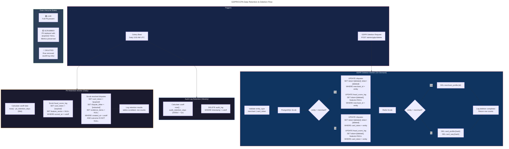

```mermaid
---
title: GDPR/CCPA Data Retention & Deletion Flow
---
graph TB
    subgraph Triggers["Triggers"]
        BEAT["Celery Beat<br/>Daily 3:00 AM UTC"]
        GDPR_REQ["GDPR Deletion Request<br/>POST /admin/gdpr/delete"]
    end

    subgraph RetentionWorker["PII Retention Worker (Daily)"]
        CALC["Calculate cutoff date<br/>now() - pii_retention_days (90d)"]
        CALC --> SCRUB_SCORES["Scrub fraud_score_log<br/>SET card_token = '[expired]'<br/>SET feature_vector = NULL<br/>WHERE scored_at < cutoff"]
        SCRUB_SCORES --> SCRUB_DISPUTES["Scrub resolved disputes<br/>SET card_token = '[expired]'<br/>SET dispute_letter = '[redacted]'<br/>SET evidence_items = NULL<br/>WHERE created_at < cutoff<br/>AND outcome IS NOT NULL"]
        SCRUB_DISPUTES --> LOG_RET["Log retention results<br/>tables scrubbed, row counts"]
    end

    subgraph AuditRetention["Audit Log Retention (Weekly)"]
        AUDIT_CALC["Calculate cutoff<br/>now() - audit_retention_days (2555d / ~7yr)"]
        AUDIT_CALC --> AUDIT_DEL["DELETE audit_log<br/>WHERE timestamp < cutoff"]
    end

    subgraph DeletionWorker["GDPR Deletion Worker (On-Demand)"]
        VALIDATE["Validate entity_type<br/>merchant | card_token"]
        VALIDATE --> DB_SCRUB["PostgreSQL Scrub"]

        DB_SCRUB --> SCRUB_M{"entity = merchant?"}
        SCRUB_M -->|Yes| SM["UPDATE disputes<br/>SET token=[deleted], letter=[deleted]<br/>WHERE merchant_id = entity<br/><br/>UPDATE fraud_score_log<br/>SET token=[deleted], features=NULL<br/>WHERE merchant_id = entity"]
        SCRUB_M -->|No| SC["UPDATE disputes<br/>SET token=[deleted], letter=[deleted]<br/>WHERE card_token = entity<br/><br/>UPDATE fraud_score_log<br/>SET token=[deleted], features=NULL<br/>WHERE card_token = entity"]

        SM & SC --> REDIS_SCRUB["Redis Scrub"]
        REDIS_SCRUB --> RD_M{"entity = merchant?"}
        RD_M -->|Yes| RDM["DEL merchant_profile:{id}"]
        RD_M -->|No| RDC["DEL card_profile:{hash}<br/>DEL card_seq:{hash}"]

        RDM & RDC --> CONFIRM["Log deletion completed<br/>Return row counts"]
    end

    BEAT --> RetentionWorker
    BEAT --> AuditRetention
    GDPR_REQ --> DeletionWorker

    subgraph DataStates["Data Lifecycle States"]
        direction LR
        LIVE["🟢 LIVE<br/>Full PII present"]
        SCRUBBED["🟡 SCRUBBED<br/>PII replaced with<br/>[expired] / NULL<br/>Metrics preserved"]
        DELETED["🔴 DELETED<br/>Row removed<br/>(audit log only)"]
    end

    style Triggers fill:#162447,stroke:#e94560,color:#eee
    style RetentionWorker fill:#1a1a2e,stroke:#ff9800,color:#eee
    style AuditRetention fill:#1a1a2e,stroke:#1565c0,color:#eee
    style DeletionWorker fill:#0f3460,stroke:#c62828,color:#eee
    style DataStates fill:#2d4059,stroke:#1b5e20,color:#eee
```
