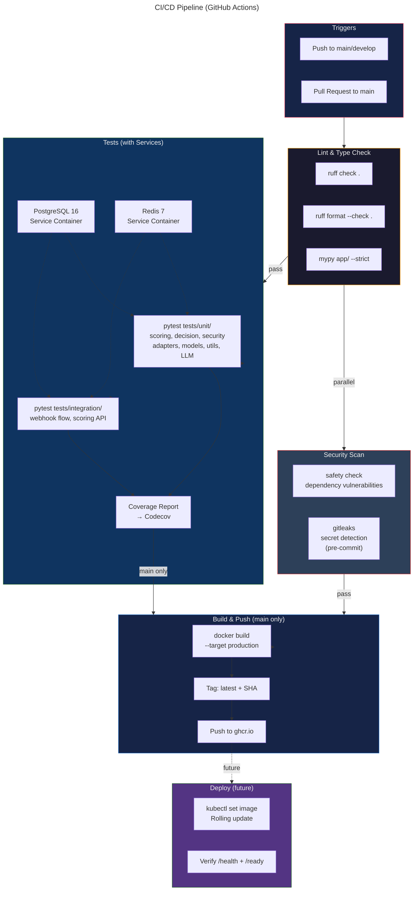

```mermaid
---
title: CI/CD Pipeline (GitHub Actions)
---
graph TD
    subgraph Trigger["Triggers"]
        PUSH["Push to main/develop"]
        PR["Pull Request to main"]
    end

    subgraph Lint["Lint & Type Check"]
        RUFF_L["ruff check ."]
        RUFF_F["ruff format --check ."]
        MYPY["mypy app/ --strict"]
    end

    subgraph Test["Tests (with Services)"]
        PG_SVC["PostgreSQL 16<br/>Service Container"]
        RD_SVC["Redis 7<br/>Service Container"]
        UNIT["pytest tests/unit/<br/>scoring, decision, security<br/>adapters, models, utils, LLM"]
        INTEG["pytest tests/integration/<br/>webhook flow, scoring API"]
        COV["Coverage Report<br/>→ Codecov"]
    end

    subgraph Security["Security Scan"]
        SAFETY["safety check<br/>dependency vulnerabilities"]
        GITLEAKS["gitleaks<br/>secret detection<br/>(pre-commit)"]
    end

    subgraph Build["Build & Push (main only)"]
        DOCKER["docker build<br/>--target production"]
        TAG["Tag: latest + SHA"]
        PUSH_REG["Push to ghcr.io"]
    end

    subgraph Deploy["Deploy (future)"]
        K8S["kubectl set image<br/>Rolling update"]
        VERIFY["Verify /health + /ready"]
    end

    Trigger --> Lint
    Lint -->|pass| Test
    Lint -->|parallel| Security
    Test --> UNIT & INTEG
    PG_SVC & RD_SVC -.-> UNIT & INTEG
    UNIT & INTEG --> COV
    COV -->|"main only"| Build
    Security -->|pass| Build
    Build --> DOCKER --> TAG --> PUSH_REG
    PUSH_REG -.->|"future"| Deploy

    style Trigger fill:#162447,stroke:#e94560,color:#eee
    style Lint fill:#1a1a2e,stroke:#ff9800,color:#eee
    style Test fill:#0f3460,stroke:#1b5e20,color:#eee
    style Security fill:#2d4059,stroke:#c62828,color:#eee
    style Build fill:#162447,stroke:#1565c0,color:#eee
    style Deploy fill:#533483,stroke:#1b5e20,color:#eee
```
