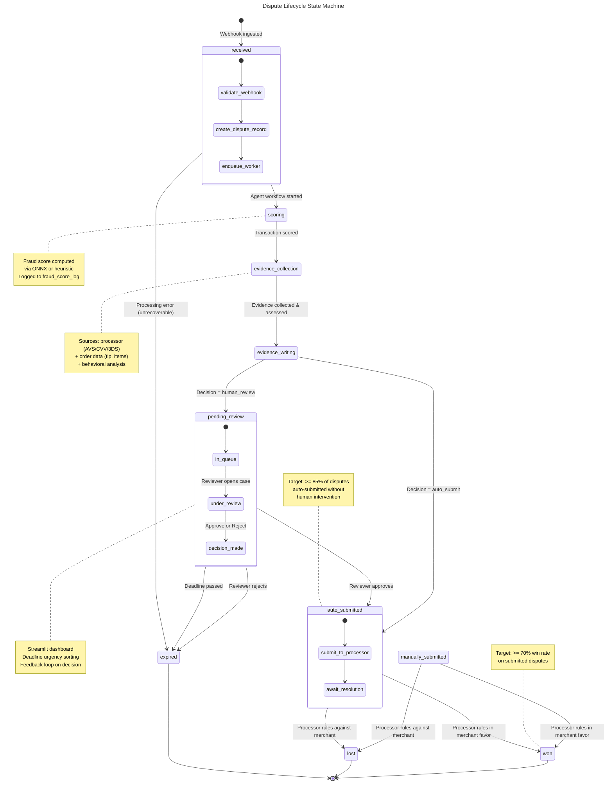

```mermaid
---
title: Dispute Lifecycle State Machine
---
stateDiagram-v2
    [*] --> received: Webhook ingested

    received --> scoring: Agent workflow started
    scoring --> evidence_collection: Transaction scored
    evidence_collection --> evidence_writing: Evidence collected & assessed
    evidence_writing --> pending_review: Decision = human_review
    evidence_writing --> auto_submitted: Decision = auto_submit

    pending_review --> auto_submitted: Reviewer approves
    pending_review --> expired: Reviewer rejects
    pending_review --> expired: Deadline passed

    auto_submitted --> won: Processor rules in merchant favor
    auto_submitted --> lost: Processor rules against merchant

    manually_submitted --> won: Processor rules in merchant favor
    manually_submitted --> lost: Processor rules against merchant

    received --> expired: Processing error (unrecoverable)

    state received {
        [*] --> validate_webhook
        validate_webhook --> create_dispute_record
        create_dispute_record --> enqueue_worker
    }

    state auto_submitted {
        [*] --> submit_to_processor
        submit_to_processor --> await_resolution
    }

    state pending_review {
        [*] --> in_queue
        in_queue --> under_review: Reviewer opens case
        under_review --> decision_made: Approve or Reject
    }

    won --> [*]
    lost --> [*]
    expired --> [*]

    note right of scoring
        Fraud score computed
        via ONNX or heuristic
        Logged to fraud_score_log
    end note

    note right of evidence_collection
        Sources: processor (AVS/CVV/3DS)
        + order data (tip, items)
        + behavioral analysis
    end note

    note right of pending_review
        Streamlit dashboard
        Deadline urgency sorting
        Feedback loop on decision
    end note

    note left of auto_submitted
        Target: >= 85% of disputes
        auto-submitted without
        human intervention
    end note

    note left of won
        Target: >= 70% win rate
        on submitted disputes
    end note
```
